# 基于onnxruntime的yolo模型推理实例

使用yolo11n为预训练模型，数据集为芒果和香蕉的成熟/未熟四分类数据集。

## 运行环境

c++运行环境为opencv 4.5.4 + ONNX Runtime 1.22.0
python运行环境为python 3.8.1 + opencv 4.5.4 + ONNX Runtime 1.21.1

由于opencv 4.5.4 尚不支持 topK算子，故使用ONNX Runtime作为模型推理框架。

考虑到minipc的硬件条件，仅使用cpu推理。

## 流程

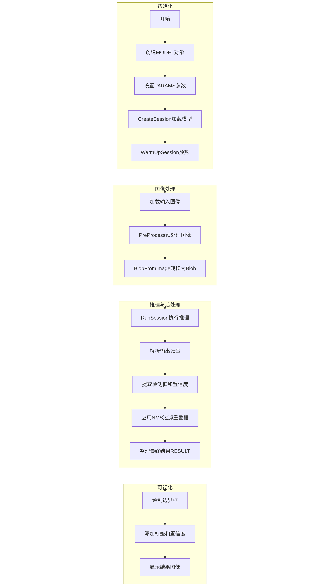

### 初始化参数、环境与模型

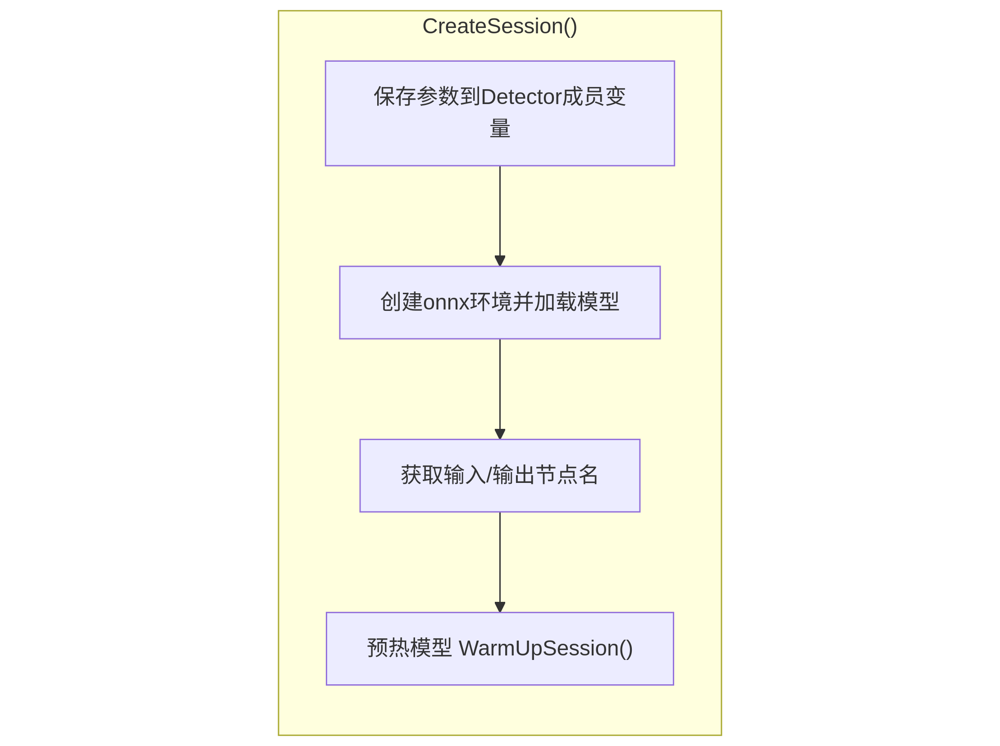

在ONNX Runtime中，**Session**是执行推理的核心对象。它封装了从模型加载到推理执行的整个生命周期和上下文。

Ort::Value 是 ONNX Runtime 中用于表示Tensor、Sequence、Map的容器类型，可用于存储输入输出数据、模型节点等等，其本身不进行计算，而是依赖算子进行计算操作。

当创建一个Session时，runtime会从模型中读取算子、计算图和初始参数，随后对每个算子选用最佳实现算法，并进行计算图优化。

当进行推理 Session.Run()时，会要求传入各个图节点的名称，runtime通过对每个节点的唯一节点名来对节点进行索引、计算依赖关系，随后依次调用算子进行计算，最后返回输出节点的Value。

### 预热

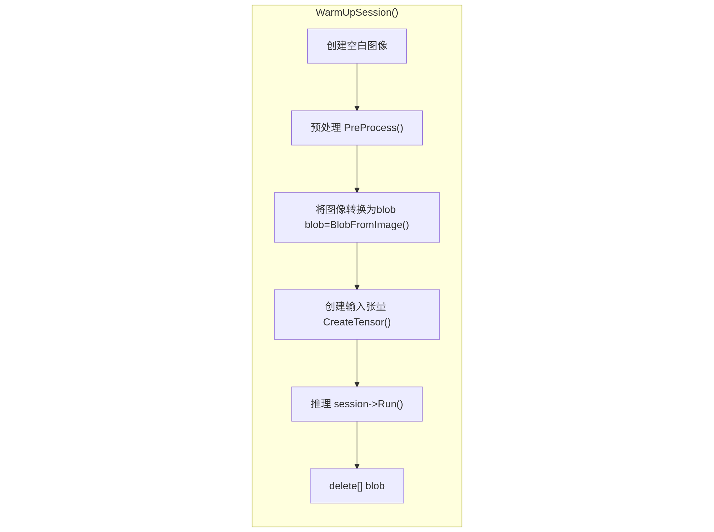

ONNX Runtime在第一次执行推理时，会根据张量流生命周期做一次完整的内存规划，确定每个中间张量的分配大小与复用时序。在推理时先使用假数据进行推理，能够触发模型的准备工作，使得之后的推理速度更快。

### 预处理

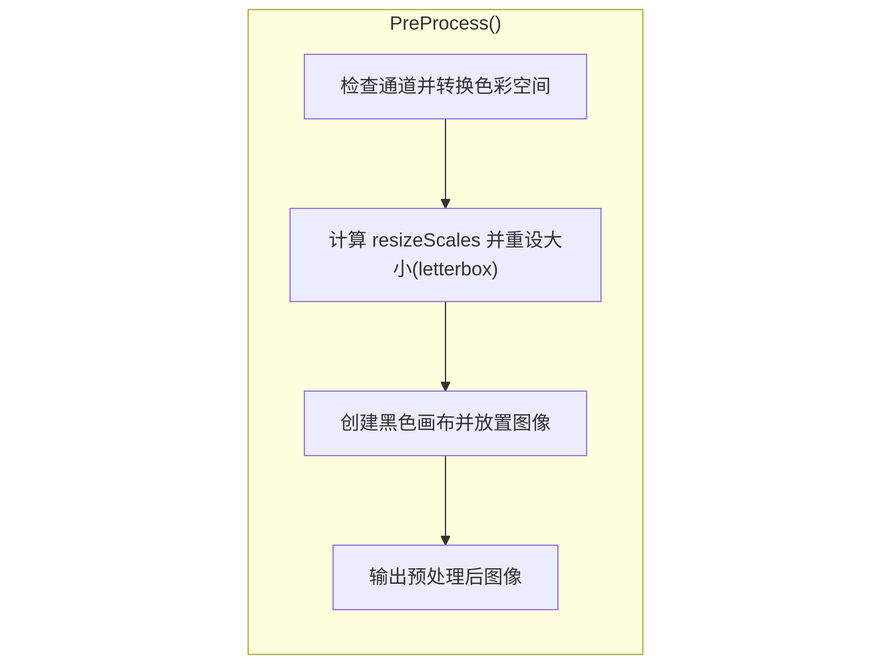

对输入图像进行预处理。使用了letterbox来缩放图像。如果直接用resize，会导致在推理完成后画框时无法准确计算坐标，同时resize导致的目标形变会降低模型性能。

letterbox：将原图按照原比例进行缩放，随后将短边用黑色填充。

效果：

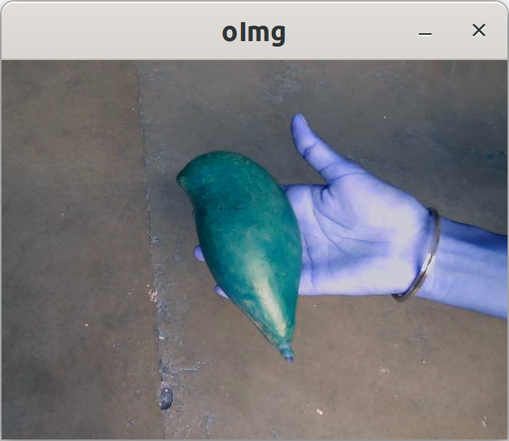

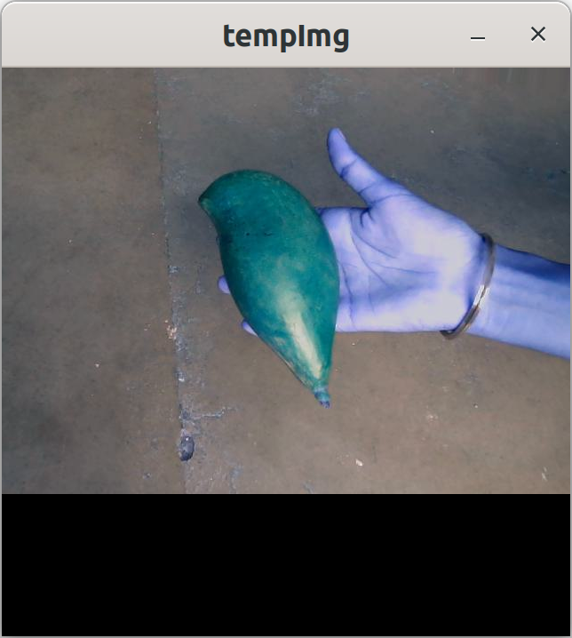

### 推理与后处理

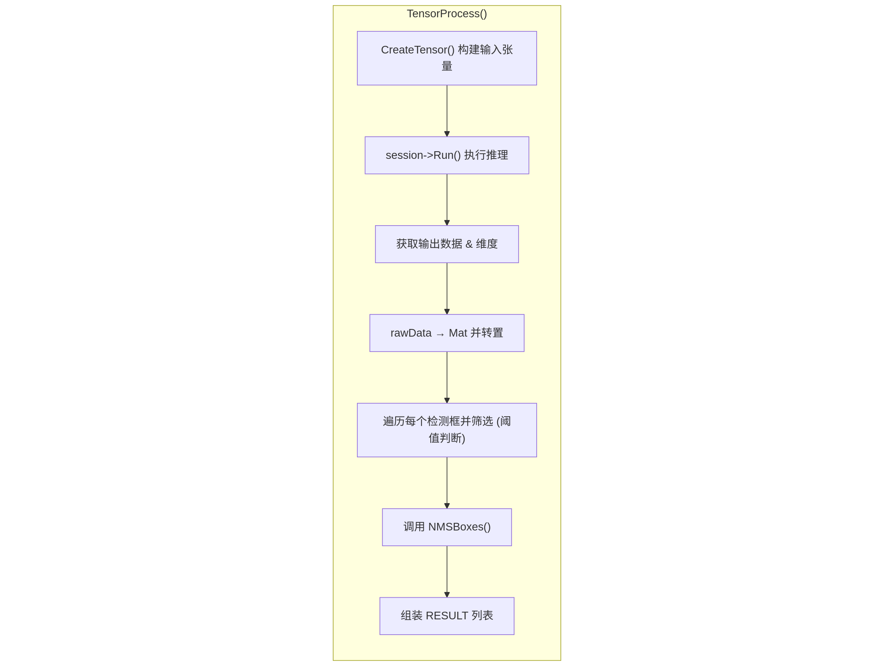

yolo11模型的输出形状为[imgBatchSize, 4 + classNum, strideNum]。
一般来说imgBatchSize = 1，则只需要将其转为[strideNum, 4 + classNum]。
4 + classNum中，4为中心点坐标与宽高[x, y, w, h]，classNum为类别数目，其中每个元素为对应类别的置信度。
strideNum为检测框的数量，我们需要遍历每个框，处理其中包含的坐标与置信度。

单纯根据置信度筛选出的框可能会重复框住一个物体，这时我们需要对其进行进一步筛选。opencv中集成了非极大值抑制（NMS）算法。
其过程为：对每个框按置信度降序排序，取出当前最高置信度的框，作为“保留”框，计算该框与剩余所有框的交并比（IoU），如果 IoU 大于设定的阈值，就把那个框丢弃，如此重复至没有剩下的框。

## 进行推理

在c++中推理：

```bash
cmake CMakeLists.txt -B build
cd build
make
./yolo_detector
```


在python中推理：运行 yolo_detector.py


## 已训练完成的模型

**best.onnx、best.pt**：opset=11，nms=False，simplify=True，未修改Detector module
**opset=11.onnx**：opset=11，nms=True，simplify=True，修改了Detector module，使其输出[1, 300, 6]，最后一维为[x, y, w, h, class, score]，同时使得后处理筛选能够获得cpu加速。
**opset=20.onnx**：opset=20，nms=True，simplify=True，修改了Detector module
**opset=11_without_nms.onnx**：opset=11，nms=False，simplify=True，修改了Detector
**opset=11_nms_original.onnx**：opset=11，nms=True，simplify=True，未修改Detector
**opset=11_without_nms_original.onnx**：opset=11，nms=False，simplify=True，未修改Detector

由于opencv 4.5.4 尚不支持 topK算子，故仅有未修改Detector且opset=11的模型可在DNN下正常加载。

## 推理效果

使用best.onnx

原图像：

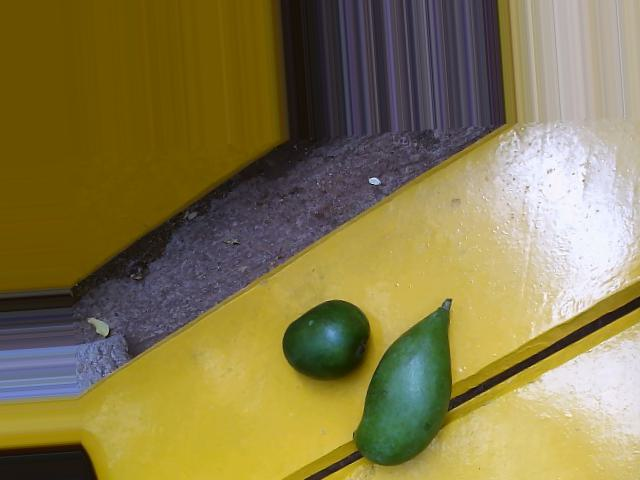

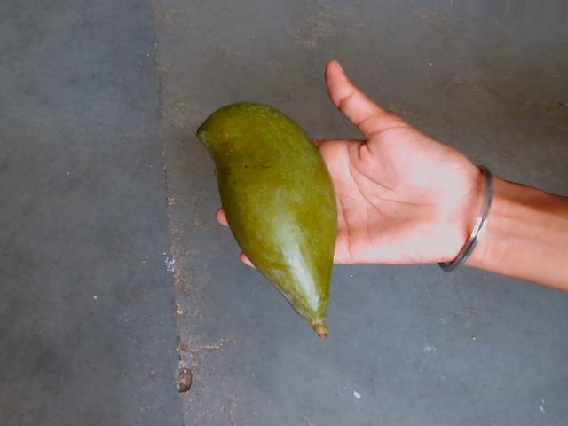

**c++**：

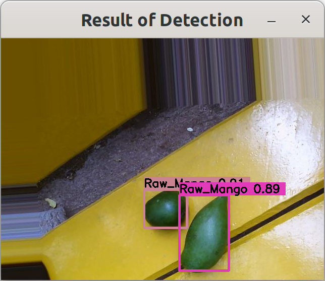

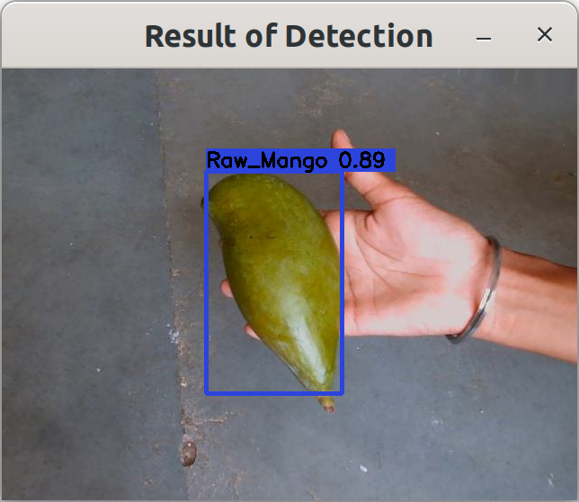

**python**：

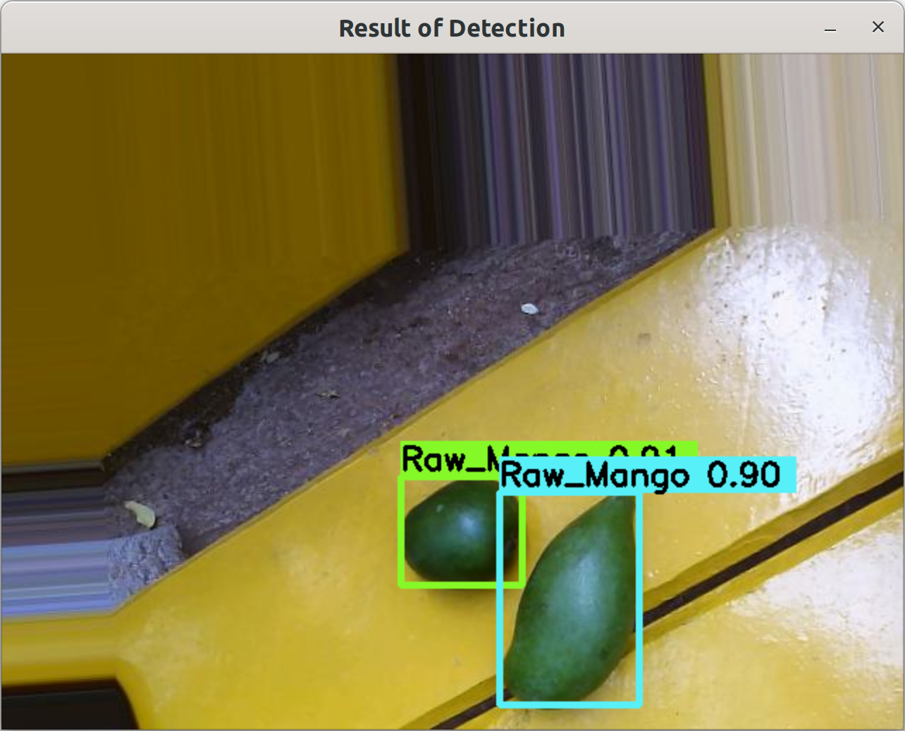

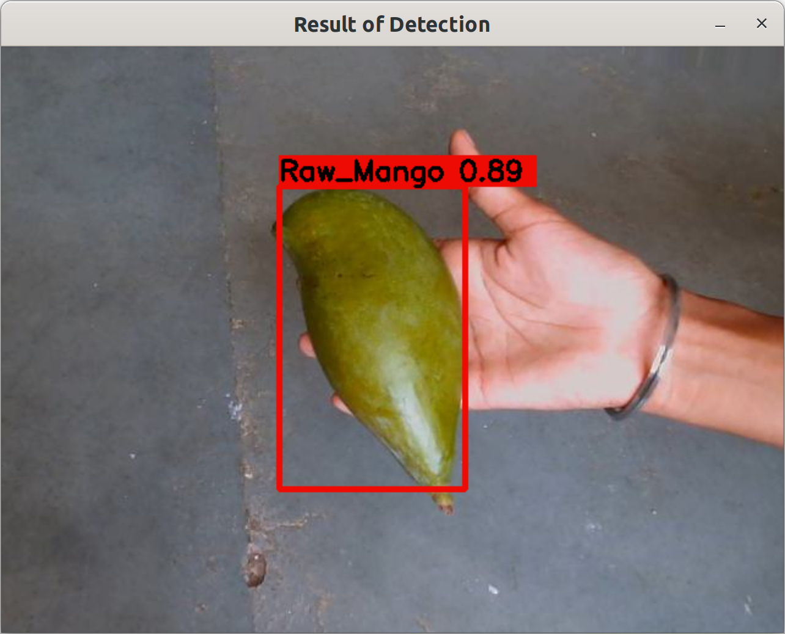


